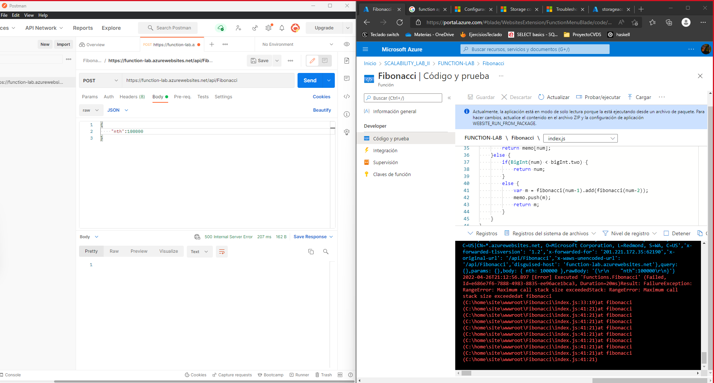

# Autores
Camilo Andres Pichimata

Juan Sebastian Cadavid

### Escuela Colombiana de Ingeniería
### Arquitecturas de Software - ARSW

### Link Function App Azure
``` 
https://function-lab.azurewebsites.net/api/Fibonacci 
```
En caso de que se intente probar tener en cuenta que la funcion que se encuentra desplegada es la que se realizo en el punto 6, por tanto las pruerbas seran limitadas, en nuestro caso el ultimo caso funcionando que fue probado fue el 10000.

## Escalamiento en Azure con Maquinas Virtuales, Sacale Sets y Service Plans

### Dependencias
* Cree una cuenta gratuita dentro de Azure. Para hacerlo puede guiarse de esta [documentación](https://azure.microsoft.com/es-es/free/students/). Al hacerlo usted contará con $100 USD para gastar durante 12 meses.
Antes de iniciar con el laboratorio, revise la siguiente documentación sobre las [Azure Functions](https://www.c-sharpcorner.com/article/an-overview-of-azure-functions/)

### Parte 0 - Entendiendo el escenario de calidad

Adjunto a este laboratorio usted podrá encontrar una aplicación totalmente desarrollada que tiene como objetivo calcular el enésimo valor de la secuencia de Fibonnaci.

**Escalabilidad**
Cuando un conjunto de usuarios consulta un enésimo número (superior a 1000000) de la secuencia de Fibonacci de forma concurrente y el sistema se encuentra bajo condiciones normales de operación, todas las peticiones deben ser respondidas y el consumo de CPU del sistema no puede superar el 70%.

### Escalabilidad Serverless (Functions)

1. Cree una Function App tal cual como se muestra en las  imagenes.


2. Instale la extensión de **Azure Functions** para Visual Studio Code.


3. Despliegue la Function de Fibonacci a Azure usando Visual Studio Code. La primera vez que lo haga se le va a pedir autenticarse, siga las instrucciones.


4. Dirijase al portal de Azure y pruebe la function.


5. Modifique la coleción de POSTMAN con NEWMAN de tal forma que pueda enviar 10 peticiones concurrentes. Verifique los resultados y presente un informe.


6. Cree una nueva Function que resuleva el problema de Fibonacci pero esta vez utilice un enfoque recursivo con memoization. Pruebe la función varias veces, después no haga nada por al menos 5 minutos. Pruebe la función de nuevo con los valores anteriores. ¿Cuál es el comportamiento?.




**Preguntas**

* ¿Qué es un Azure Function?

    Azure Functions, es básicamente una solución del tipo FaaS o “función como servicio”, que nos permite ejecutar fácilmente pequeñas piezas de código, o “funciones”, en la nube. El coste que Azure nos repercutirá será el del tiempo de ejecución del código de nuestra función, además si tenemos muchas peticiones a nuestra función, Azure escalará de forma elástica a más instancias o menos en función de la cantidad de peticiones que nuestra función tenga que atender.

* ¿Qué es serverless?

    Serverless computing es un modelo de ejecución de computación en la nube en el que el proveedor de los servicios en la nube destina por demanda recursos de las máquinas virtuales, cuidando de los servidores por sus clientes.

* ¿Qué es el runtime y que implica seleccionarlo al momento de crear el Function App?

    runtime: Se denomina tiempo de ejecución al intervalo de tiempo en el que un programa de computadora se ejecuta en un sistema operativo. 
    
* ¿Por qué es necesario crear un Storage Account de la mano de un Function App?

    La cuenta de almacenamiento proporciona un espacio de nombres único para los datos de Azure Storage que es accesible desde cualquier lugar del mundo mediante HTTP o HTTPS. Los datos de la cuenta de almacenamiento son duraderos y altamente disponibles, seguros y escalables a gran escala.

* ¿Cuáles son los tipos de planes para un Function App?, ¿En qué se diferencias?, mencione ventajas y desventajas de cada uno de ellos.

    Los tipos de planes son Consume, Premium y Dedicado(App Service). Estos se diferencian en que el de Consume escale de forma automática y genera gastos cuando los recursos del proceso solo se esten ejecutando las funciones.

    -   Plan de hospedaje predeterminado.
    -   Pague solo cuando se ejecutan las funciones.
    -    Escala de forma automática, incluso durante períodos de carga elevada. 
    
    El premium escala automáticamente en función de la demanda mediante trabajos preparados previamente que ejecutan aplicaciones sin ningún retraso después de estar inactivas, ejecuta en instancias más eficaces y se conecta a redes virtuales.
    - La aplicación de funciones se ejecuta de forma continua, o casi continua.
    - Tiene un gran número de ejecuciones pequeñas y una factura de ejecución elevada, pero pocos GB por segundo en el plan de consumo.
    -  Necesita más opciones de CPU o memoria de las que proporciona el plan de consumo.
    -   Su código debe ejecutarse durante más tiempo del máximo permitido en el plan de consumo.
    - Necesita características que no están disponibles en el plan de consumo, como la conectividad con red virtual.
    - Quiere proporcionar una imagen personalizada de Linux en la que ejecutar sus funciones.
    
    El Dedicado Ejecute las funciones en un plan de App Service a los Precios de App Service normales. Mejor para escenarios de ejecución prolongada en los que no se puede usar Durable Functions. Considere el plan de App Service en las situaciones siguientes:
    - Tiene máquinas virtuales infrautilizadas que ya ejecutan otras instancias de App Service.
    - Se requieren escalado y costos predictivos.

* ¿Por qué la memoization falla o no funciona de forma correcta?
    
    Debido a que este cuenta con un límite de llamados para la función recurrente, después de x llamados esta falla, en nuestro caso probamos hasta 10000 antes de que fallara, al realizar la prueba con 100000 este ya fallaba.

* ¿Cómo funciona el sistema de facturación de las Function App?

    Pues de acuerdo al Consumer y premium este depende del uso que se le dé a la función, si esta no se encuentra en uso no pasara nada, ya que no se están usando los recursos, pero en el momento que se empiece a usar de acuerdo a la demanda que se le dé a esta empezara a usar más recursos y así mismo sus costos.